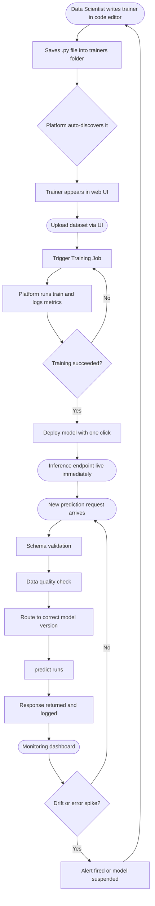

# How I Built a Customer Segmentation Model in 200 Lines of Python — And Deployed It to Production Without Touching a Server

*A practical walkthrough using MLDock, an ML platform that handles the infrastructure so you can focus on the model. Customer segmentation is one example — the same pattern works for any model you want to build.*

---

I want to show you something. This is a complete, production-ready customer segmentation model:

```python
class CustomerSegmentationTrainer(BaseTrainer):
    name = "customer_segmentation"
    display_name = "Customer Segmentation"

    def train(self, data, config):
        df = self.preprocess(data)
        model = KMeans(n_clusters=config.get("n_clusters", 5))
        model.fit(df[FEATURE_COLS])
        bundle = TrainerBundle(model=model, feature_names=FEATURE_COLS)
        bundle.save(self.name)
        return {"silhouette_score": silhouette_score(df[FEATURE_COLS], model.labels_)}

    def predict(self, inputs):
        bundle = TrainerBundle.load_latest(self.name)
        # ... run prediction ...
        return {"groups": [...], "summary": {...}}
```

That's it. No infra to configure. No deployment pipeline to wire up. You write this file in your code editor, save it to the trainers folder, and in seconds it appears in a running web UI where you can train it, run predictions, monitor drift, and A/B test it against a new version.

This article is about how that works, why it matters for data scientists, and how to build the segmentation model step by step.

---

## First — What Is Customer Segmentation and Why Should You Care?

Imagine you run an online store with 50,000 customers. Some buy every week and spend big. Some bought once six months ago and never came back. Some browse constantly but only buy when there's a discount. Some are completely silent.

If you send everyone the same marketing email, the big spenders feel under-appreciated, the dormant ones ignore you, and the discount-hunters wait for the next promo. You're leaving money on the table and annoying the customers who matter most.

**Customer segmentation** is the practice of automatically grouping your customers by behaviour so you can treat each group differently. Instead of one message to 50,000 people, you have five targeted strategies:

| Segment | What they look like | What you do |
|---|---|---|
| **High Value** | Frequent buyers, high spend | Loyalty rewards, early access |
| **Loyal** | Regular spend, mid-range frequency | Upsell, cross-sell |
| **At Risk** | Haven't bought in a while, used to be active | Win-back campaign, personal offer |
| **Dormant** | Bought once, gone quiet | Re-engagement email or cut your losses |
| **Occasional** | Low frequency, low spend | Nurture with content, move them up |

This is one of the most widely used techniques in e-commerce, banking, telecoms, and SaaS — anywhere you have customers with varying behaviour. Done well, it directly increases revenue and reduces churn.

The traditional way to build it involves a data analyst writing SQL queries, a data scientist training a model in a notebook, an engineer packaging it into a service, and a product manager waiting three weeks to see anything. The goal of this article is to show that the whole thing can live in a single Python class and be in production in an afternoon.

> **Note:** The segmentation model in this article is a simplified demonstration. A production segmentation system for a large business would include more features (recency scoring, product affinity, lifetime value estimates), more sophisticated clustering (HDBSCAN, Gaussian Mixture Models), and deeper validation. Think of this as the working foundation you'd build on top of — not the final word.

---

## The Problem with ML Deployment

If you've built ML models before, you know the frustrating part isn't the modelling. It's everything that comes after.

You train a model locally. It works great on your laptop. Then you need to:

- Package it so another service can call it
- Store the trained artifact somewhere reliable
- Write an API endpoint to serve predictions
- Log every inference so you can debug problems later
- Set up monitoring so you know when the model starts drifting
- Build a UI so non-engineers can test it

Every step takes hours. The model itself might have taken an afternoon. The infrastructure around it takes weeks.

MLDock is a platform that collapses those weeks into nothing. You write the model. The platform handles everything else.

---

## What Is MLDock?

MLDock is an ML inference and training platform. It provides:

- **A plugin system** — drop a Python file with your trainer class, it's automatically discovered and registered
- **A training pipeline** — trigger training jobs from the UI or on a schedule; metrics are tracked automatically
- **An inference API** — every deployed model gets a REST endpoint immediately
- **A monitoring layer** — data drift detection, performance dashboards, circuit breakers (auto-suspend a model if it starts failing)
- **A web UI** — train, test, inspect logs, compare model versions, all from a browser

Here's the high-level flow — from writing a trainer to getting predictions back in production:



The platform is built around one concept: the `BaseTrainer` contract. If your class implements it, everything else is handled for you.

The platform is built around one concept: the `BaseTrainer` contract. If your class implements it, everything else is handled for you.

Customer segmentation is just one example of what you can build with this pattern. The same contract works for any model type:

- **OCR / computer vision** — pass a base64-encoded image in, return extracted text or bounding boxes
- **Churn prediction** — feed customer activity features, return a churn probability score
- **Maintenance ticket classification** — classify free-text tickets into categories with priority scores
- **Demand forecasting** — feed historical sales time series, return per-SKU demand predictions
- **Fraud / anomaly detection** — score incoming transactions with an isolation forest or autoencoder
- **Rent / price prediction** — regression model over property features, returning a suggested price range
- **Document classification** — route uploaded PDFs into document types (invoice, contract, ID)

Each of these is a separate Python file. Each one gets its own training pipeline, its own inference endpoint, its own monitoring dashboard, its own A/B test slot. The platform infrastructure is shared — you just keep adding trainers.

---

## The BaseTrainer Contract

Every trainer in MLDock is a Python class that inherits from `BaseTrainer` and implements two methods:

```python
from app.abstract.base_trainer import BaseTrainer

class MyTrainer(BaseTrainer):
    name = "my_model"           # unique ID — used as the URL slug
    display_name = "My Model"   # shown in the UI

    def train(self, data: Any, config: Dict) -> Dict:
        """Train the model. Return a metrics dict."""
        ...

    def predict(self, inputs: Dict[str, Any]) -> Any:
        """Run inference. Return whatever the model produces."""
        ...
```

That's the entire API surface you're responsible for. The platform calls `train()` when a training job is triggered. It calls `predict()` when an inference request comes in. Everything else — scheduling, logging, artifact versioning, serving the HTTP API, drift detection — is handled by the platform.

---

## Where Does the Training Data Come From?

This is where `DatasetDataSource` comes in, and it's one of the more elegant features of the platform.

A `DatasetDataSource` is MLDock's built-in data management layer. It's a managed dataset that lives inside the platform — users can upload CSV files to it through the UI, and your trainer can read from it without any file path management.

You declare a `DatasetDataSource` on your trainer class like this:

```python
from app.abstract.base_trainer import BaseTrainer, DatasetDataSource

class CustomerSegmentationTrainer(BaseTrainer):
    name = "customer_segmentation"

    data_source = DatasetDataSource(
        slug="customer-transactions",          # unique name for this dataset
        label="Customer Transactions",
        description="Upload a CSV with customer transaction history",
        auto_create_spec={                     # auto-creates the dataset if it doesn't exist
            "name": "Customer Transactions",
            "fields": [
                {"name": "transactions_csv", "type": "file", "label": "CSV File", "required": True}
            ]
        }
    )
```

When the platform sees this declaration, it:

1. Creates the dataset in the platform's dataset registry (if it doesn't already exist)
2. Shows an upload interface in the trainer's UI panel
3. Makes the uploaded data available in `self.preprocess()` when training is triggered

Inside `preprocess()`, you retrieve the uploaded file using `_fetch_bytes()`:

```python
def preprocess(self, data: Any) -> pd.DataFrame:
    file_bytes = self._fetch_bytes(data, field_label="CSV File")
    df = pd.read_csv(io.BytesIO(file_bytes))
    # ... clean and engineer features ...
    return df
```

`_fetch_bytes()` is a `BaseTrainer` helper method. It looks at the training data descriptor, finds the field matching the label you specified, downloads the file from storage (MLDock uses S3-compatible object storage), and returns the raw bytes. You don't deal with storage keys, presigned URLs, or download logic — you just get bytes.

This decoupling is important: the same `DatasetDataSource` can be updated with new CSVs at any time, and the next training run will pick up the latest data automatically.

---

## The Artifact Problem: Why Models Break at Inference

Before showing the full segmentation code, I want to explain `TrainerBundle` — because this is the thing that most toy ML tutorials skip, and it's the most common way production models break silently.

When you train a machine learning model, you usually do preprocessing steps: scaling numeric features, encoding categoricals, selecting which columns to use. These steps are fitted on the training data. The fitted state is critical — the same transformation must be applied at inference time.

A common pattern:

```python
# Training
scaler = StandardScaler()
X_scaled = scaler.fit_transform(X_train)
model = KMeans(n_clusters=5)
model.fit(X_scaled)
joblib.dump(model, "model.pkl")   # ← PROBLEM: scaler not saved
```

When you load `model.pkl` later and call `predict()`, you need to scale the new data first. But you didn't save the scaler. So either you fit a new scaler on the prediction input (wrong — different scale than training), or you hardcode the scaler parameters (fragile), or you forget entirely and pass unscaled data to the model (silent garbage output).

`TrainerBundle` solves this by bundling everything together into one artifact:

```python
from app.abstract.base_trainer import TrainerBundle

# Training — bundle everything
bundle = TrainerBundle(
    model=kmeans,
    scaler=scaler,
    feature_names=FEATURE_COLS,
    label_map={0: "High Value", 1: "At Risk", 2: "Dormant", ...}
)
bundle.save(self.name)   # registers the versioned artifact in the platform's model registry

# Inference — load the same bundle
bundle = TrainerBundle.load_latest(self.name)
X_scaled = bundle.scaler.transform(X_raw[bundle.feature_names])
labels = bundle.model.predict(X_scaled)
segment_names = [bundle.label_map[l] for l in labels]
```

`bundle.save()` serialises the entire bundle — model, scaler, feature names, label map — and registers it in the platform's model registry under the trainer's name. `load_latest()` loads the most recently registered version. Both methods handle artifact paths, versioning, and storage — you don't need to manage any of that.

---

## The Full Customer Segmentation Trainer

Here's the complete implementation, explained section by section.

```python
import io
import uuid
import pandas as pd
import numpy as np
from sklearn.cluster import KMeans
from sklearn.preprocessing import StandardScaler
from sklearn.metrics import silhouette_score
from typing import Any, Dict, List

from app.abstract.base_trainer import (
    BaseTrainer,
    DatasetDataSource,
    TrainerBundle,
    TrainingConfig,
    OutputFieldSpec,
)
```

The imports are standard data science libraries plus five things from the platform.

---

### Declaring the Trainer Metadata

```python
FEATURE_COLS = [
    "PurchaseFrequency",
    "AvgTransactionValue",
    "DaysSinceLastPurchase",
    "TotalSpend",
    "UniqueProductCategories",
]

SEGMENT_LABELS = {
    0: "High Value",
    1: "Loyal",
    2: "At Risk",
    3: "Dormant",
    4: "Occasional",
}

class CustomerSegmentationTrainer(BaseTrainer):
    name = "customer_segmentation"
    display_name = "Customer Segmentation"
    description = "Segments customers by purchase behaviour using K-Means clustering."
    supports_batch = True
```

`name` is the trainer's unique identifier — it becomes part of the inference URL (`POST /infer/customer_segmentation`) and the key used to look up trained artifacts in the registry.

`supports_batch` = True means the UI will show a batch inference tab where users can upload a CSV and get predictions for all rows at once.

---

### Declaring the Data Source

```python
    data_source = DatasetDataSource(
        slug="customer-transactions",
        label="Customer Transactions",
        description="CSV with one row per customer. Required columns: CustomerID, TotalSpend, PurchaseFrequency, DaysSinceLastPurchase, UniqueProductCategories.",
        auto_create_spec={
            "name": "Customer Transactions",
            "fields": [
                {
                    "name": "transactions_csv",
                    "type": "file",
                    "label": "Transactions CSV",
                    "required": True,
                }
            ]
        }
    )
```

When this trainer is first registered, the platform creates a dataset called "Customer Transactions" in the dataset registry. The trainer UI shows a file upload button. When a user uploads a CSV, it gets stored in the platform's object storage and associated with this dataset entry.

---

### Declaring What the Model Needs at Inference Time

```python
    input_schema = {
        "transaction_data": {
            "type": "file",
            "label": "Transaction Data CSV",
            "required": True,
            "description": "CSV with columns: CustomerID, TotalSpend, PurchaseFrequency, DaysSinceLastPurchase, UniqueProductCategories",
            "sample_url": "",  # set this to a public URL for a downloadable sample
        }
    }
```

`input_schema` describes what the inference endpoint expects. The platform uses this to:

1. Validate incoming inference requests before they reach `predict()`
2. Render the inference UI — `type: "file"` shows a file upload widget
3. Show a sample download link if `sample_url` is set

---

### Declaring How the Output Should Be Displayed

```python
    output_schema = {
        "groups": {
            "type": "list",
            "label": "Customer Segments",
        },
        "summary": {
            "type": "json",
            "label": "Segment Summary",
        }
    }

    output_display = [
        OutputFieldSpec(key="groups", type="table_list", label="Customer Segments", span=2),
        OutputFieldSpec(key="summary", type="json", label="Segment Summary"),
    ]
```

`output_schema` is the data contract — it tells API consumers the shape of the response.

`output_display` is the UI rendering spec. `table_list` renders a `List[Dict]` as a scrollable HTML table with colour-coded label pills and formatted numbers. `json` renders a dict as a formatted, collapsible code block. `span=2` makes the groups table take full width in the two-column grid.

---

### Training Configuration

```python
    training_config = TrainingConfig(
        hyperparameters={
            "n_clusters": {"type": "int", "default": 5, "min": 2, "max": 12, "label": "Number of Segments"},
            "max_iter": {"type": "int", "default": 300, "label": "Max K-Means Iterations"},
        },
        schedule="0 2 * * 1",   # auto-retrain every Monday at 2am
    )
```

`TrainingConfig` tells the platform what hyperparameters the model accepts (rendered as form inputs in the UI), and optionally a cron schedule for automatic retraining.

The `schedule` field means the platform will automatically trigger a new training run every Monday at 2am, picking up whatever is currently in the dataset. If the segmentation model needs to stay fresh as new customers are added, this handles it without any cron job management on your end.

---

### Preprocessing

```python
    def preprocess(self, data: Any) -> pd.DataFrame:
        file_bytes = self._fetch_bytes(data, field_label="Transactions CSV")
        df = pd.read_csv(io.BytesIO(file_bytes))

        # Feature engineering
        df["AvgTransactionValue"] = (
            df["TotalSpend"] / df["PurchaseFrequency"].replace(0, np.nan)
        ).fillna(0)

        # Drop rows with missing required columns
        df = df.dropna(subset=FEATURE_COLS)

        return df
```

`_fetch_bytes()` downloads the uploaded file from object storage and returns the raw bytes. You decode it however you like. Everything else is standard pandas.

---

### Training

```python
    def train(self, data: Any, config: Dict) -> Dict:
        df = self.preprocess(data)

        X = df[FEATURE_COLS].values
        scaler = StandardScaler()
        X_scaled = scaler.fit_transform(X)

        n_clusters = config.get("n_clusters", 5)
        model = KMeans(n_clusters=n_clusters, max_iter=config.get("max_iter", 300), random_state=42, n_init=10)
        model.fit(X_scaled)

        score = silhouette_score(X_scaled, model.labels_)

        # Build a label map from cluster index → segment name
        # Sort clusters by mean TotalSpend so label assignment is stable
        cluster_means = {
            i: df[df.index.isin(np.where(model.labels_ == i)[0])]["TotalSpend"].mean()
            for i in range(n_clusters)
        }
        sorted_clusters = sorted(cluster_means.items(), key=lambda x: -x[1])
        label_map = {
            orig_idx: list(SEGMENT_LABELS.values())[rank]
            for rank, (orig_idx, _) in enumerate(sorted_clusters)
        }

        # Bundle model + scaler + feature names + labels together
        bundle = TrainerBundle(
            model=model,
            scaler=scaler,
            feature_names=FEATURE_COLS,
            label_map=label_map,
        )
        bundle.save(self.name)

        return {
            "silhouette_score": round(score, 4),
            "n_clusters": n_clusters,
            "n_samples": len(df),
        }
```

The return value of `train()` is the metrics dict. The platform logs these automatically and displays them in the training run history — no extra instrumentation needed.

---

### Prediction

```python
    def predict(self, inputs: Dict[str, Any]) -> Dict:
        bundle = TrainerBundle.load_latest(self.name)

        # inputs["transaction_data"] is either a file path or raw bytes — _fetch_bytes handles both
        file_bytes = self._fetch_bytes(inputs, field_label="Transaction Data CSV")
        df = pd.read_csv(io.BytesIO(file_bytes))

        df["AvgTransactionValue"] = (
            df["TotalSpend"] / df["PurchaseFrequency"].replace(0, np.nan)
        ).fillna(0)
        df = df.dropna(subset=bundle.feature_names)

        X_scaled = bundle.scaler.transform(df[bundle.feature_names].values)
        cluster_ids = bundle.model.predict(X_scaled)

        # Assign confidence scores from distance to cluster centre
        distances = bundle.model.transform(X_scaled)   # shape: (n_rows, n_clusters)
        min_distances = distances[np.arange(len(distances)), cluster_ids]
        max_dist = min_distances.max() if min_distances.max() > 0 else 1
        confidence_scores = 1 - (min_distances / max_dist)

        groups = []
        for i, (_, row) in enumerate(df.iterrows()):
            groups.append({
                "CustomerID": str(row.get("CustomerID", i)),
                "Segment": bundle.label_map.get(cluster_ids[i], f"Cluster {cluster_ids[i]}"),
                "TotalSpend": round(float(row["TotalSpend"]), 2),
                "PurchaseFrequency": int(row["PurchaseFrequency"]),
                "AvgTransactionValue": round(float(row["AvgTransactionValue"]), 2),
                "DaysSinceLastPurchase": int(row["DaysSinceLastPurchase"]),
                "Confidence": round(float(confidence_scores[i]), 3),
            })

        # Aggregate summary
        result_df = df.copy()
        result_df["Segment"] = [bundle.label_map.get(c, f"Cluster {c}") for c in cluster_ids]
        summary = {}
        for seg, grp in result_df.groupby("Segment"):
            summary[seg] = {
                "count": len(grp),
                "avg_spend": round(grp["TotalSpend"].mean(), 2),
                "avg_frequency": round(grp["PurchaseFrequency"].mean(), 1),
            }

        return {"groups": groups, "summary": summary}
```

A few things to notice:

1. `TrainerBundle.load_latest(self.name)` fetches the most recently trained model, scaler, feature names, and label map from the platform's model registry as one unit. The prediction uses the same scaler that was fitted during training — no scaler mismatch.

2. `_fetch_bytes()` works in both directions: when called from `train()`, it downloads from the dataset storage. When called from `predict()`, the platform has already resolved the input file and made it available under the field label. The same helper works in both contexts.

3. The confidence score is computed from the distance to the nearest cluster centre, normalised to [0, 1]. Closer to the centroid = higher confidence in the assignment.

4. The return value is `{"groups": [...], "summary": {...}}` — a list of per-customer results plus an aggregate. This matches the `output_schema` and `output_display` declarations at the top of the class, so the UI knows to render `groups` as a scrollable table and `summary` as a collapsible JSON block.

---

## Deploying It: Step by Step

Here is the exact flow from writing the code to running your first prediction.

### Step 1 — Write and save the trainer

Open your code editor, write the trainer class (as shown throughout this article), and save it to the trainers directory:

```
apps/ml/trainers/customer_segmentation.py
```

### Step 2 — Install and run the platform

Start the MLDock service. On first run it scans the trainers directory and registers every trainer it finds. Your `CustomerSegmentationTrainer` is now live inside the platform.

### Step 3 — Go to Build → Trainers

Open the MLDock web UI and navigate to **Build → Trainers**. You will see your trainer listed — "Customer Segmentation" — alongside any others that are registered.

### Step 4 — Select your trainer and start a run

Click on **Customer Segmentation**. You will see a training panel with:
- The hyperparameter inputs you declared (`n_clusters`, `max_iter`)
- The dataset upload area connected to your `DatasetDataSource`

Upload your transactions CSV, adjust `n_clusters` if needed, then click **Run**.

### Step 5 — Monitor progress or wait for a notification

Training runs asynchronously. You can:
- Watch the live progress log in the UI as each epoch completes
- Leave the page — the platform will send you a notification when training finishes

Either way, you will see the silhouette score and other metrics appear once the run completes.

### Step 6 — Open the Models page and run a sample inference

If training succeeds, navigate to **Models**, find your trainer, and click into it. You will land on the model detail page where you can:

1. See the training metrics from this run alongside previous versions
2. Upload a sample CSV and click **Run Inference**
3. See the output rendered immediately — a colour-coded segment table and a summary panel

If training fails, the platform keeps you on the training page with the error log so you can fix the issue and re-run. Nothing is lost.

### Calling it from your own code

Once a model is deployed you can call it from any application:

```python
import requests

with open("customers.csv", "rb") as f:
    response = requests.post(
        "https://your-mldock-instance.io/infer/customer_segmentation",
        headers={"X-API-Key": "pms_ml_your_key_here"},
        files={"transaction_data": f},
    )

result = response.json()
# result["groups"] — list of per-customer segment assignments
# result["summary"] — aggregate stats per segment
```

---

## What Happens Under the Hood at Inference Time

When you POST to `/infer/customer_segmentation`, the platform runs several steps before your `predict()` method ever sees the data:

1. **Schema validation** — checks the incoming request against `input_schema`. Missing required fields get a structured error back immediately, before any model code runs.

2. **Data quality check** — for numeric fields, the platform computes a Z-score against the distribution of recent inference inputs. If a value is 4+ standard deviations from the historical mean, the response includes a warning alongside the prediction. This catches sentinel values, wrong-unit inputs, and integration bugs without blocking the request.

3. **Circuit breaker check** — if the model has failed 5 consecutive requests (e.g. a corrupted artifact), the circuit breaker trips and subsequent requests return a `503` immediately instead of hanging. The model auto-recovers after a timeout.

4. **Inference log** — every prediction (success or failure) is written to the inference log. The UI shows the full history: what came in, what came out, latency, which model version was used.

All of this is infrastructure you'd otherwise have to build yourself. With MLDock, it's part of the platform by default.

---

---

## Why This Matters

The reason I think platforms like this are significant isn't the feature list. It's the feedback loop.

When a model is easy to deploy, data scientists run more experiments. When every experiment is automatically logged and versioned, rollbacks are instant. When drift detection is built in, the team finds out about distribution shifts from the dashboard rather than from a user complaint six weeks later.

The customer segmentation model I described took about 3 hours to write, test, and deploy. In a traditional setup — building the training script, packaging it, writing the inference API, wiring the monitoring — that same model would take a week, and you'd probably skip the drift detection entirely because there isn't time.

The reduced deployment cost changes what's worth building. Models that would be too small to justify the infrastructure overhead suddenly make sense. That's where the real leverage is.

---

## This Is Just One Model. You Can Build a Whole Team of Them.

The real power of this pattern becomes clear when you run multiple trainers on the same platform.

In our own deployment, we have trainers for meter reading OCR, maintenance ticket classification, rent prediction, churn risk scoring, and IP threat detection — all running side by side, each with their own scheduled retraining, drift alerts, and inference logs. A data scientist can add a new model type on a Monday morning and have it in production by afternoon. The infrastructure doesn't change.

The customer segmentation example in this article is a complete, working starting point. But the `BaseTrainer` contract is the same whether you're building a simple regression, a computer vision pipeline, an NLP classifier, or a generative model that wraps an LLM. The shape is always the same: implement `train()` and `predict()`, declare your schemas, save the file to the trainers directory.

That's the pitch. You can build your entire ML capability as a collection of focused, self-contained trainer plugins — no duplicated infrastructure, no per-model DevOps, no separate deployment pipelines. Add a trainer, and it just works.

## Try It

MLDock is part of the PMS platform. The plugin guide at `/plugin-guide` in the UI covers the full `BaseTrainer` API: all schema field types, output display specs, batch prediction, custom `predict_batch()` implementations, and how to write multi-step output schemas for models that return grouped or nested results.

If you're building ML systems and spending more time on infrastructure than on models, it's worth a look. Reach out if you'd like to learn more about getting access.

---

*Tagged: Machine Learning · Python · MLOps · Customer Segmentation · Data Science · Open Source · FastAPI · scikit-learn*
